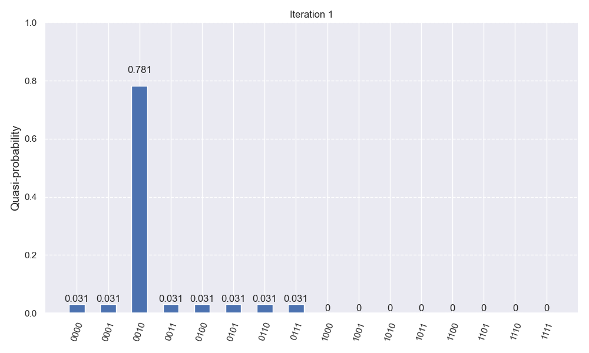
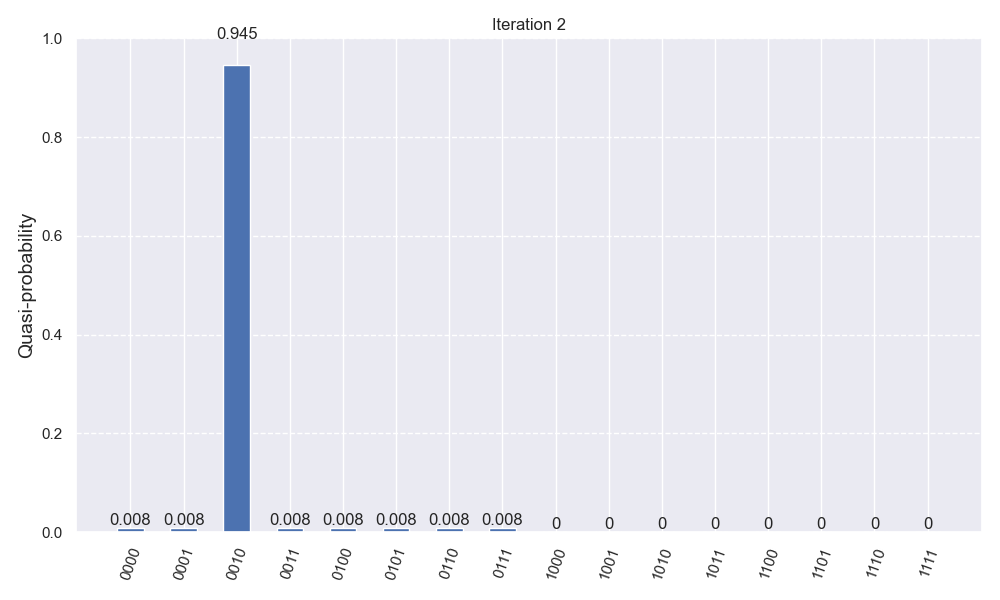

# Grover's Algorithm (3-Qubit Search)

A Qiskit implementation of Grover's search algorithm using 4 qubits (3 for search, 1 for phase kickback).

## 📊 Amplitude Amplification
The target state is amplified over two iterations. By tracking the **Statevector**, we can see the probability distribution shift before measurement.

### Iteration 1

### Iteration 2

## 🛠️ Logic
* **Oracle:** Marks the target state $|010\rangle$ using phase kickback.
* **Diffuser:** Performs inversion about the mean to amplify the marked state.
* **Visualization:** Plots captured using `qiskit.visualization` with a fixed Y-axis [0, 1] for honest comparison.
